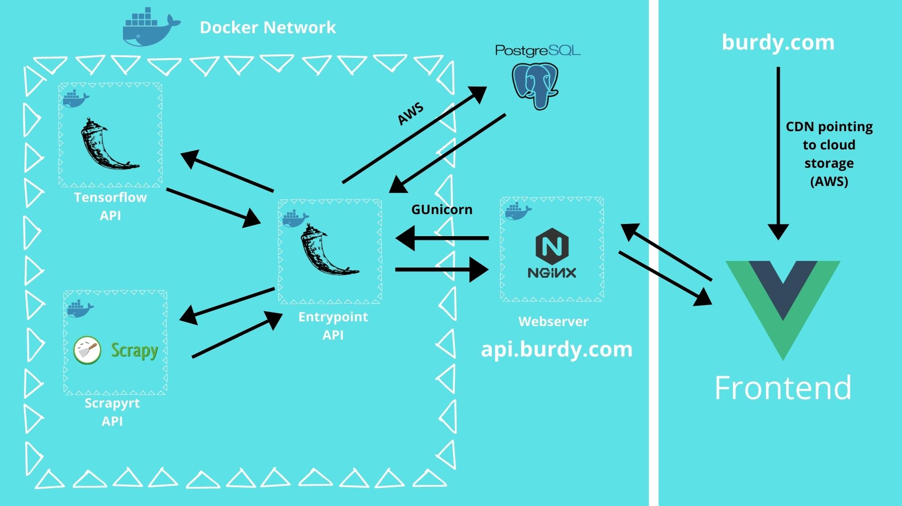

# Burdy
Voice of customer software 

Inspiration for name:

> This web-app is supposed to be a 'birdie' that listens to your customer concerns and then tells you about them. 

In a nutshell, burdy goes to amazon.ca to find interesting 'copy-worthy' statements from amazon reviews. It uses a scraper to gather the reviews, then performs sentimental analysis on the reviews. After that, it shows you all the scaped reviews under their relavent categories and download them to your computer.

Burdy is a web-based application, using Vue for client-side and python-based microservices. Backend microservices are connected via a Docker Network.

Microservices:
* Authentication/Entry point API: All authentication and user information interaction are made here, and client can access only this API. This API would then forward requests to other microservices as neccessary. This API is built with Flask + G-Unicorn and uses NGINX as the primary web-server in production.

* Scraper: built with the scrapy library and turned into a API thanks to the generous help of the contributors at [scrapyrt](https://scrapyrt.readthedocs.io/en/stable/). The scraper's role was to go to an inputted product url on amazon.ca and scrape a desired amount of reviews.

* Sentimental Analysis API: the role of this microservice was to take all scraped amazon reviews and classify them into classes that may be useful to a copywriter. Look at classifications txt if you're interested in the specific classes. This is a Flask API that houses a custom-made Tensorflow algorithim. 

Feel free to use any of the code and if you have any questions just send me a message.

Here's a visual summary of architecture:

